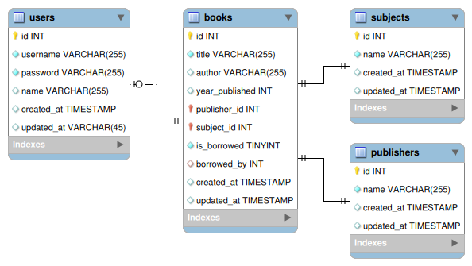

# Library App

### Penjelasan Proyek
Aplikasi library (perpustakaan) adalah aplikasi yang dapat digunakan untuk meminjam atau mengembalikan buku secara online. Pengguna dapat melakukan peminjaman atau pengembalian buku setelah pengguna melakukan login melalui aplikasi. Jika pengguna belum memiliki akun, maka pengguna dapat melakukan registrasi melalui aplikasi.

### Dokumentasi API
[https://documenter.getpostman.com/view/12352177/2s8YzXvLC6](https://documenter.getpostman.com/view/12352177/2s8YzXvLC6)

### Live Deployment
[https://final-project-production-755a.up.railway.app/](https://final-project-production-755a.up.railway.app/)

### Desain Database

## Contributing
Pull requests are welcome. For major changes, please open an issue first to discuss what you would like to change.

## License
[MIT](https://choosealicense.com/licenses/mit/)